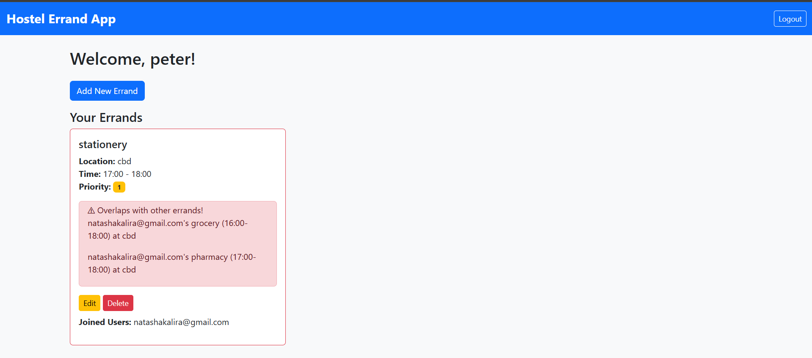

# 🏠 Hostel Errand App

[](https://www.python.org/)  
[](https://flask.palletsprojects.com/)  
[](LICENSE)

A **community-driven web application** that helps hostel residents manage errands efficiently, avoid scheduling conflicts, collaborate, and communicate in a shared inbox.

---

## **🌟 Features**

- ✅ User Authentication (Register & Login)  
- ✅ Add, Edit, and Delete Errands  
- ✅ Detect overlapping errands automatically  
- ✅ Join other users' errands  
- ✅ Inbox/Chat for joined errands  
- ✅ Color-coded dashboard for priority & overlaps  
- ✅ Display joined users  

---

## **📸 Screenshots**

### Dashboard
  

### Add Errand
  

---

## **🛠 Tech Stack**

- **Backend:** Python 3.14, Flask, Flask-Login, Flask-SQLAlchemy  
- **Database:** SQLite (local, instance/database.db)  
- **Frontend:** Bootstrap 5, HTML, CSS  
- **Version Control:** Git & GitHub  

---

## **📁 Project Structure**

```

hostel_connector/
│
├─ app.py                # Main Flask app
├─ instance/
│   └─ database.db       # SQLite database
├─ templates/            # HTML templates
│   ├─ base.html
│   ├─ login.html
│   ├─ register.html
│   ├─ dashboard.html
│   ├─ add_errand.html
│   └─ inbox.html
└─ static/
└─ style.css         # Optional custom CSS

````

---

## **⚡ Installation**

1. **Clone repo**:

```bash
git clone https://github.com/YourUsername/hostel-errand-app.git
cd hostel-errand-app
````

2. **Create a virtual environment**:

```bash
python -m venv venv
# Activate it:
# Windows
venv\Scripts\activate
# macOS/Linux
source venv/bin/activate
```

3. **Install dependencies**:

```bash
pip install flask flask_sqlalchemy flask_login
```

4. **Run the app**:

```bash
python app.py
```

5. Open in browser: [http://127.0.0.1:5000](http://127.0.0.1:5000)

---

## **🚀 Usage**

1. Register a new user
2. Login
3. Add errands with name, location, time, and priority
4. Join overlapping errands from other users
5. Chat in the errand inbox

---

## **🤝 Contributing**

We welcome contributions!

* Add features like real-time chat or notifications
* Improve the UI with animations and themes
* Deploy to production using Heroku, PythonAnywhere, or AWS

---

## **📜 License**

This project is licensed under the **MIT License**.
